# CRUD 分解動作 - 簡易票選系統實作

- [第 00 步 - 修改 Route](#step00)
- [第 01 步 - 新增 Controller](#step01)
- [第 02 步 - 新增 Model](#step02)
- [第 03 步 - 新增 View](#step03)
- [第 04 步 -「候選人列表」功能](#step04)
- [第 05 步 -「新增候選人資料」功能 Part 1](#step05)
- [第 06 步 -「新增候選人資料」功能 Part 2](#step06)
- [第 07 步 -「編輯候選人資料」功能 Part 1](#step07)
- [第 08 步 -「編輯候選人資料」功能 Part 2](#step08)
- [第 09 步 -「編輯候選人資料」功能 Part 3](#step09)
- [第 10 步 -「刪除候選人資料」功能](#step10)
- [第 11 步 -「投票給某位候選人」功能](#step11)
- [第 12 步 - 整理重複的程式碼](#step12)
- [第 13 步 - 使用 bootstrap 來美化頁面](#step13)
- [第 14 步 - 使用 gem 來簡化表單](#step14)

CRUD 是 Create, Read, Update 跟 Delete 四個字的縮寫，對 Rails 來說，開發 CRUD 應用程式可以說是它的強項，甚至用 Scaffold 一行指令就搞定。第一次用 Scaffold 會感覺非常神奇，但對新手來說也不知道到底發生什麼事。所以接下來我們一步一步分解 CRUD 的各項動作，希望可以讓大家更了解 Rails 的一些慣例以及它是怎麼運作的。

## 實作：票選系統

就讓我們直接實作一個簡單的投票系統，稍微再熟悉 Rails 的 MVC 運作方式以及表單處理。在開始前，先再次複習一下這張 MVC 的圖解：

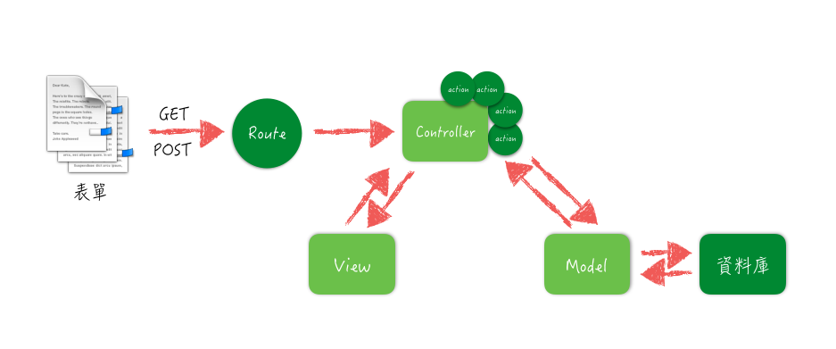

當你填寫表單完成並按下送出後，表單會以 GET 或 POST 的方式傳送資料，Route 就會根據路徑以及動作(HTTP Verb)來決定這次的任務該由哪個 Controller 的哪個 Action 處理。

### 系統功能

1. 可以新增、修改、刪除候選人資料(姓名、黨派、年齡、政見，以上資料都是必填欄位)
2. 可以投票給候選人

### <a name="step00"></a>第 00 步 - 修改 Route

因為 Route 是整個 Rails 應用程式的第一關，所以在思考要新增功能的時候，我通常第一步都是先想 Route 要怎麼規劃。

1. 因為要可以新增、修改、刪除候選人，所以我使用 `resoruces` 直接做出完整的 CRUD 路徑
2. 因為要投票給某一位候選人，所以我用 `member` 的方式加了一組 `post :vote`，補充原本 CRUD 的 8 個路徑。

程式碼如下：

```ruby
Rails.application.routes.draw do
  resources :candidates do
    member do
      post :vote
    end
  end
end
```

這樣就可以做出以下的路徑：

    $ rails routes
            Prefix Verb   URI Pattern                    Controller#Action
    vote_candidate POST   /candidates/:id/vote(.:format) candidates#vote
        candidates GET    /candidates(.:format)          candidates#index
                   POST   /candidates(.:format)          candidates#create
     new_candidate GET    /candidates/new(.:format)      candidates#new
    edit_candidate GET    /candidates/:id/edit(.:format) candidates#edit
         candidate GET    /candidates/:id(.:format)      candidates#show
                   PATCH  /candidates/:id(.:format)      candidates#update
                   PUT    /candidates/:id(.:format)      candidates#update
                   DELETE /candidates/:id(.:format)      candidates#destroy

除了原來 `resources` 方法做的 8 個路徑之外，還多了 `vote_candidate` 這條路徑。

### <a name="step01"></a>第 01 步 - 新增 Controller

有了路徑，知道要往哪邊去了，接下來就是要把要去的地方完成。先使用產生器把 Controller 做出來：

    $ rails g controller candidates
    Running via Spring preloader in process 39745
          create  app/controllers/candidates_controller.rb
          invoke  erb
          create    app/views/candidates
          invoke  test_unit
          create    test/controllers/candidates_controller_test.rb
          invoke  helper
          create    app/helpers/candidates_helper.rb
          invoke    test_unit
          invoke  assets
          invoke    coffee
          create      app/assets/javascripts/candidates.coffee
          invoke    scss
          create      app/assets/stylesheets/candidates.scss

### <a name="step02"></a>第 02 步 - 新增 Model

讓我們想一下這個候選人(Candidate) 的 Model 要有哪些欄位：

| 欄位名稱 | 資料型態                |   說明     |
|:---------|:-----------------------:|:-----------|
|name      | 字串(string)            | 候選人姓名 |
|party     | 字串(string)            | 政黨       |
|age       | 數字(integer)           | 年齡       |
|politics  | 文字(text)              | 政見       |
|votes     | 數字(integer)，預設值 0 | 得票數     |


候選人的資料表大概先這樣設計，但其實直接把得票數放在這裡不是很適當，應該另外開一個 Model 記錄得票過程，但這個功能會留到後面說明 Model 關連的時候再實作這個功能會更有感覺。讓我們使用產生器幫你建立 Model 吧：

    $ rails g model candidate name party age:integer politics:text votes:integer
    Running via Spring preloader in process 41648
          invoke  active_record
          create    db/migrate/20161229084544_create_candidates.rb
          create    app/models/candidate.rb
          invoke    test_unit
          create      test/models/candidate_test.rb
          create      test/fixtures/candidates.yml

因為我們想要給得票數(`votes`)的預設值設定成 0，但這件事沒辦法直接從產生器的指令完成，所以請先編輯一下 migration 檔，在 `t.integer :votes` 那行後面加上 `default: 0` 以設定這個欄位的預設值：

```ruby
class CreateCandidates < ActiveRecord::Migration[5.0]
  def change
    create_table :candidates do |t|
      t.string :name
      t.string :party
      t.integer :age
      t.text :politics
      t.integer :votes, default: 0

      t.timestamps
    end
  end
end
```

最後，別忘了把 Migration 轉換成真正的表格：

    $ rails db:migrate
    == 20161229084544 CreateCandidates: migrating =================================
    -- create_table(:candidates)
       -> 0.0044s
    == 20161229084544 CreateCandidates: migrated (0.0045s) ========================

### <a name="step03"></a>第 03 步 - 新增 View

有 Route、Controller 跟 Model 之後，接下來就要做頁面跟表單了。

請先在 `app/views/candidates` 目錄下新增以下幾個檔案：

| 檔案名稱        | 用途               |
|-----------------|--------------------|
| index.html.erb  | 全部候選人列表     |
| new.html.erb    | 新增候選人資料     |
| edit.html.erb   | 全部候選人列表     |

Rails 裡沒有專門為 View 設計的產生器，所以請自己手動新增檔案。

### <a name="step04"></a>第 04 步 -「候選人列表」功能

「候選人列表」頁面要把所有的候選人的資料從資料表抓出來，然後顯示在畫面上，所以這個步驟需要動到 Controller、View 以及 Model (不過事實上 Model 在這個步驟不需要做什麼事)。這個步驟需要先修改 Controller 跟 `index.html.erb` 頁面，先讓我們看一下 Controller：

```ruby
class CandidatesController < ApplicationController
  def index
    @candidates = Candidate.all
  end
end
```

直接用 Model 的 `all` 類別方法取得所有資料，並存成 `@candidates` 實體變數，以便待會在 View 可使用。

注意事項：
1. 慣例上，像這種取出來是一批資料的，都會使用複變名詞，例如 `@candidates` 或 `@users`。
2. 除非必要，請儘量先考慮使用區域變數而不要使用實體變數，以上面這個例子來說，因為稍後要在 View 使用 `@candidates` 變數所以才使用實體變數。


接下來修改 `index.html.erb`：

```erb
<h1>候選人列表</h1>

<%= link_to "新增候選人", new_candidate_path %>

<table>
  <thead>
    <tr>
      <td>候選人姓名</td>
      <td>政黨</td>
      <td>政見</td>
      <td>得票數</td>
    </tr>
  </thead>
  <tbody>
    <% @candidates.each do |candidate| %>
    <tr>
      <td><%= candidate.name %>(年齡：<%= candidate.age %> 歲)</td>
      <td><%= candidate.party %></td>
      <td><%= candidate.politics %></td>
      <td><%= candidate.votes %></td>
    </tr>
    <% end %>
  </tbody>
</table>
```

這裡有幾個地方需要說明一下：

1. 最上面的「新增候選人」連結，雖然可以使用一般的 `<a href="...">..</a>` 方式來寫，但在 Rails 裡更建議使用 `link_to` 方法來製作。
2. 中間的那段 Block 裡面的變數命名，慣例上會使用前面那個實體變數(`@candidates`)的單數名詞(`candidate`)。
3. 你有發現我們在這個檔案只有從 `<h1>` 開始寫，但檢視原始碼的時候卻發現像是 `<html>`、`<title>` 跟 `<body>` 等標籤都出現了，這個其實是 Rails 裡的 Layout 做的好事，會在下個章節介紹。

現在的畫面應該會長得像這樣：

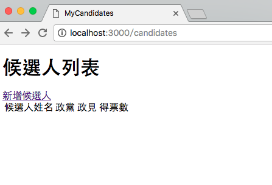

目前因為都還沒有資料所以一片空白很正常。

### <a name="step05"></a>第 05 步 -「新增候選人資料」功能 Part 1

這個步驟比前面幾步麻煩一點，需要修改的地方主要是 Controller 跟 View。

先讓我們編輯 `app/views/candidates/new.html.erb`，把新增資料的表單放在這個頁面：

```erb
<h1>新增候選人</h1>

<%= form_for(@candidate) do |f| %>
  <%= f.label :name, "姓名" %>
  <%= f.text_field :name %> <br />

  <%= f.label :age, "年齡" %>
  <%= f.text_field :age %> <br />

  <%= f.label :party, "政黨" %>
  <%= f.text_field :party %> <br />

  <%= f.label :politics, "政見" %>
  <%= f.text_area :politics %> <br />

  <%= f.submit %>
<% end %>

<br />
<%= link_to '回候選人列表', candidates_path %>
```

這個 `form_for` 跟前個章節再介紹 BMI 計算機的 `form_tag` 有點類似，但更厲害一點。`form_for` 方法接的是一個 Model 物件，在這裡我們先傳一個名為 `@candidate` 的實體變數給它，待會在 Controller 再看看它是怎麼做出來的。在 `form_for` 方法後面的那個 Block 裡面的 `f` 變數，是一種 [FormBuilder](http://api.rubyonrails.org/classes/ActionView/Helpers/FormBuilder.html)物件，可以透過這個物件上的 `text_field`、`text_area` 或 `submit` 方法做出對應的 `<input>` 標籤。

接下來我們看一下 Controller：

```ruby
class CandidatesController < ApplicationController
  def index
    @candidates = Candidate.all
  end

  def new
    @candidate = Candidate.new
  end
end
```

多加了一個 `new` 方法，裡面只放了簡單的一行，就是使用 `Candidate` 這個 Model 做出一個新的實體，並存為 `@candidate` 實體變數供 View 使用。現在的畫面應該是這個樣子：

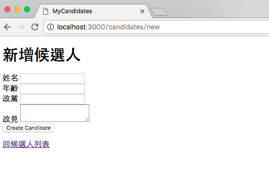

不怎麼美觀! 沒關係，晚點我們再想辦法。

在 Controller 的 `new` 方法裡設定的實體變數 `@candidate`，就是要給剛剛前面 `form_for` 用的。`form_for` 除了可以產生 `<form>` 標籤之外，它的 `action`，也就是當你按下送出按鈕要去的那個地方，會根據傳給它的這個物件是新的還是舊的而自己判斷。在這裡因為是剛剛才做出來的，`form_for` 會認為你現在是要做「新增」這件事。檢視一下原始碼，看一下 `<form>` 的那段：

```html
<form class="new_candidate" id="new_candidate" action="/candidates" accept-charset="UTF-8" method="post">
```

因為它認為你是要「新增」，所以 action 的網址自動幫你設定成 `/candidates`，並且使用 `post` 方法傳送。回想一下我們目前的 Route：

    $ rails routes
            Prefix Verb   URI Pattern                    Controller#Action
    vote_candidate POST   /candidates/:id/vote(.:format) candidates#vote
        candidates GET    /candidates(.:format)          candidates#index
                   POST   /candidates(.:format)          candidates#create
     new_candidate GET    /candidates/new(.:format)      candidates#new
    edit_candidate GET    /candidates/:id/edit(.:format) candidates#edit
         candidate GET    /candidates/:id(.:format)      candidates#show
                   PATCH  /candidates/:id(.:format)      candidates#update
                   PUT    /candidates/:id(.:format)      candidates#update
                   DELETE /candidates/:id(.:format)      candidates#destroy

對 `/candidates` 路徑使用 `POST` 方法，Route 會去找 `candidates#create` 處理。

咦? 怎麼這麼巧? 其實這不是巧合，這就是 Rails 的慣例。

### <a name="step06"></a>第 06 步 -「新增候選人資料」功能 Part 2

即然知道按下送出之後會把資料拋給 Controller 的 `create` 方法，那就來接球吧：

```ruby
class CandidatesController < ApplicationController
  # .. [略] ..

  def create
    @candidate = Candidate.new(params[:candidate])

    if @candidate.save
      # 成功
      redirect_to candidates_path, notice: "新增候選人成功!"
    else
      # 失敗
      render :new
    end
  end
end
```

傳過來的那包資料會被收集在 `params` 裡，所以透過 `params[:candidate]` 把它丟給 Candidate Model，接著呼叫 `save` 方法準備存檔。如果存檔成功，便轉往候選人列表頁(`redirect_to`)，並帶有一提示訊息(Flash，後面的章節會再介紹)說「新增候選人成功!」；如果失敗，則重新 render 新增頁面，並顯示錯誤訊息。

看起來沒什麼問題，但當你按下新增之後會發生錯誤畫面如下：

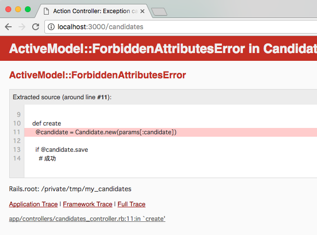

這個 `ActiveModel::ForbiddenAttributesError` 錯誤訊息發生的原因，是因為我們試圖把 `params[:candidates]` 裡的資料一口氣塞進 Model 裡，這樣做會有安全上的問題，有心人士可以透過這個方式直接覆寫某個欄位的值而取得特別權限。

Rails 4 之後有提供一個稱之 Strong Parameters 的方式，讓你可以對這包 params 進行「清洗」，寫法如下：

```ruby
class CandidatesController < ApplicationController
  # .. [略] ..

  private
  def candidate_params
    params.require(:candidate).permit(:name, :age, :party, :politics)
  end
end
```

方法名稱可自定，但因為這個方法沒有要給外部存取，所以通常會放在 `private` 區塊。裡面的 `permit` 方法就是說「我只允許 `name`、`age`, `party` 以及 `:politics` 這些參數通過，其它的來我會無視」。因為 params 的內容現在只能通過你有「放行」的欄位，所以就算是被「清洗」過了。

別忘了把原本這行：

```ruby
@candidate = Candidate.new(params[:candidate])
```

改成：

```ruby
@candidate = Candidate.new(candidate_params)
```

應該就可以順利新增資料了

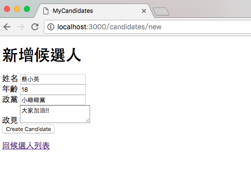

按下按鈕後

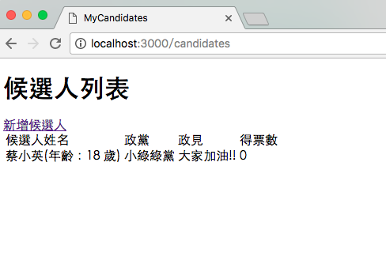

### <a name="step07"></a>第 07 步 -「編輯候選人資料」功能 Part 1

再來是編輯功能，先在列表頁把「編輯」的連結加上去，「刪除」跟「投票」的連結也順便加一下吧：

```erb
<h1>候選人列表</h1>

<%= link_to "新增候選人", new_candidate_path %>

<table>
  <thead>
    <tr>
      <td>投票</td>
      <td>候選人姓名</td>
      <td>政黨</td>
      <td>政見</td>
      <td>得票數</td>
      <td>處理</td>
    </tr>
  </thead>
  <tbody>
    <% @candidates.each do |candidate| %>
    <tr>
      <td><%= link_to "投給這位", vote_candidate_path(candidate), method: "post", data: { confirm: "確認要投給這位候選人嗎?!" } %></td>
      <td><%= candidate.name %>(年齡：<%= candidate.age %> 歲)</td>
      <td><%= candidate.party %></td>
      <td><%= candidate.politics %></td>
      <td><%= candidate.votes %></td>
      <td>
        <%= link_to "編輯", edit_candidate_path(candidate) %>
        <%= link_to "刪除", candidate_path(candidate), method: "delete", data: { confirm: "確認刪除" } %>
      </td>
    </tr>
    <% end %>
  </tbody>
</table>
```

這邊沒有太複雜的程式碼，只有用了 `link_to` 方法加了三個連結。幾件事情提醒：

1. 如果不知道那個 `_path` 怎麼寫，請到終端機執行 `rails routes` 查閱。
2. `link_to` 的方法要用對，該用 `POST` 或 `DELETE` 但卻忘了加，會造成找不到路徑的錯誤訊息。

現在的畫面應該會長得像這樣：

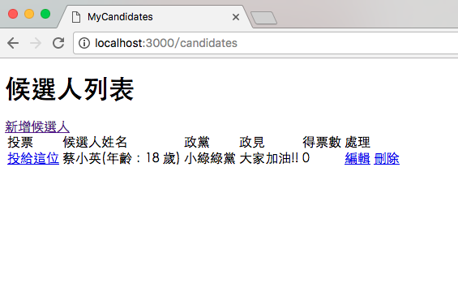

### <a name="step08"></a>第 08 步 -「編輯候選人資料」功能 Part 2

即然要「編輯」某一筆資料，首先當然要先在 Controller 裡把那筆資料抓出來：

```ruby
class CandidatesController < ApplicationController
  # .. [略] ..

  def edit
    @candidate = Candidate.find_by(id: params[:id])
  end

  # .. [略] ..
end
```

使用 Model 的 `find_by` 方法，把 `id` 是 `params[:id]` 的資料抓出來，並存成實體變數 `@candidate`。

這個 `params[:id]` 是什麼? 先讓我們執行 `rails routes` 來看一下：

    $ rails routes
            Prefix Verb   URI Pattern                    Controller#Action
    .. [略]..
     new_candidate GET    /candidates/new(.:format)      candidates#new
    edit_candidate GET    /candidates/:id/edit(.:format) candidates#edit
         candidate GET    /candidates/:id(.:format)      candidates#show
                   PATCH  /candidates/:id(.:format)      candidates#update
                   PUT    /candidates/:id(.:format)      candidates#update
                   DELETE /candidates/:id(.:format)      candidates#destroy

在候選人列表頁，當你點下編輯之後，它的網址可能會是 `/candidates/1/edit` 這樣，跟 Route 比對之後就可以發現，那個 `1` 就是 Route 路徑裡的 `:id`，它也會被捕捉在 `params` 裡，使用 `params[:id]` 就可以調出來用。

接著，編輯 `app/views/candidates/edit.html.erb` 頁面：

```erb
<h1>編輯候選人</h1>

<%= form_for(@candidate) do |f| %>
  <%= f.label :name, "姓名" %>
  <%= f.text_field :name %> <br />

  <%= f.label :age, "年齡" %>
  <%= f.text_field :age %> <br />

  <%= f.label :party, "政黨" %>
  <%= f.text_field :party %> <br />

  <%= f.label :politics, "政見" %>
  <%= f.text_area :politics %> <br />

  <%= f.submit %>
<% end %>

<br />
<%= link_to '回候選人列表', candidates_path %>
```

咦? 等等! 這個程式碼的內容怎麼跟新增的頁面有九成像? 其實這就是 `form_for` 神奇的地方。因為 `form_for` 發現傳進來的那顆 `@candidate` 物件是舊的(就是從資料庫裡調出來的)，它會認定你是準備要「編輯」，所以不只 `<form>` 的 Action 網址會幫你依照慣例設定好，連值也會自動幫你帶進表單裡。

這時候的畫面長這樣：

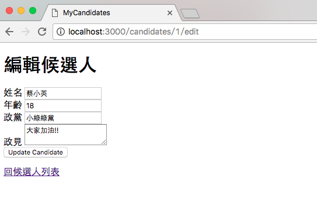

但這個程式碼跟新增的實在是太像了，所以我們可以把重複的地方抽出來，存在另一個檔案。請手動新增一個叫做 `_form.html.erb` 的檔案，放在 `app/views/candidates/` 裡，內容如下：

```erb
<%= form_for(@candidate) do |f| %>
  <%= f.label :name, "姓名" %>
  <%= f.text_field :name %> <br />

  <%= f.label :age, "年齡" %>
  <%= f.text_field :age %> <br />

  <%= f.label :party, "政黨" %>
  <%= f.text_field :party %> <br />

  <%= f.label :politics, "政見" %>
  <%= f.text_area :politics %> <br />

  <%= f.submit %>
<% end %>

<br />
<%= link_to '回候選人列表', candidates_path %>
```

然後原本「新增」的頁面 `app/views/candidates/new.html.erb` 的內容可改成這樣：

```erb
<h1>新增候選人</h1>

<%= render "form" %>
```

「編輯」的頁面 `app/views/candidates/edit.html.erb` 的內容也可改成這樣：

```erb
<h1>編輯候選人</h1>

<%= render "form" %>
```

兩個頁面都變得短短的二、三行，把共同的內容都放到 `_form` 裡面了。這個技巧在 Rails 稱之局部渲染(Partial Render)，通常會用來整理重複的程式碼。檔名不一定要叫 `_form`，你也可以取做 `_abcdefg`，但要用的時候就要改寫成 `<%= render "abcdefg" %>`。

> 注意：這個 Partial Render 的檔名必須要是底線開頭，不然會發生找不到的錯誤訊息

### <a name="step09"></a>第 09 步 -「編輯候選人資料」功能 Part 3

根據 Route 的路徑對照表，當對 `candidates/:id` 網址以 `PUT` 或 `PATCH` 方式傳送時，會觸發 CandidateController 上的 `update` 方法，我們把這個功能給補上去：

```ruby
class CandidatesController < ApplicationController
  # ..[略]..

  def update
    @candidate = Candidate.find_by(id: params[:id])

    if @candidate.update_attributes(candidate_params)
      # 成功
      redirect_to candidates_path, notice: "資料更新成功!"
    else
      # 失敗
      render :edit
    end
  end

  # ..[略]..
end
```

`update` 方法寫起來其實跟 `new` 有點像，差別在於這邊是使用 `update_attributes` 方法更新資料。同樣的，為了安全考量，如果是直接丟沒有清洗過的 params 給它的話，也一樣會發生錯誤訊息。若編輯存檔成功，將會轉往候選人列表頁面，若失敗則重新 redner 編輯頁面。

回瀏覽器試一下，這樣編輯功能應該就完成了喔!

### <a name="step10"></a>第 10 步 -「刪除候選人資料」功能

跟編輯功能比起來，刪除功能算是相對單純的，只要把資料抓出來就可以直接刪除了。根據 Route 的路徑，對 `/candidates/:id` 網址以 `DELETE` 發送資料時，會觸發 CandidateController 的 `destroy` 方法，所以就讓我們把 `destroy` 方法加上去：

```ruby
class CandidatesController < ApplicationController
  # .. [略] ..

  def destroy
    @candidate = Candidate.find_by(id: params[:id])
    @candidate.destroy if @candidate
    redirect_to candidates_path, notice: "候選人資料已刪除!"
  end

  # .. [略] ..
end
```

一樣使用 Model 的 `find_by` 方法，把要刪除的資料抓出來，然後呼叫那個物件的 `destroy` 方法，這樣這筆資料就會刪掉了。

### <a name="step11"></a>第 11 步 -「投票給某位候選人」功能

根據我們在 Route 裡的設定，當對 `/candidates/:id/vote` 網址使用 `POST` 方法發送資料時，將會觸發 CandidateController 上的 `vote` 方法。

```ruby
class CandidatesController < ApplicationController
  # .. [略] ..

  def vote
    @candidate = Candidate.find_by(id: params[:id])
    @candidate.increment(:votes)
    @candidate.save
    redirect_to candidates_path, notice: "完成投票!"
  end

  # .. [略] ..
end
```

一樣是先把那筆資料抓出來，增加 `votes` 欄位的值 (也可使用 `update_attributes` 方式更新)，投票完成轉往候選人首頁。測試一下功能：

按下「投給這位」連結，跳出確認視窗：

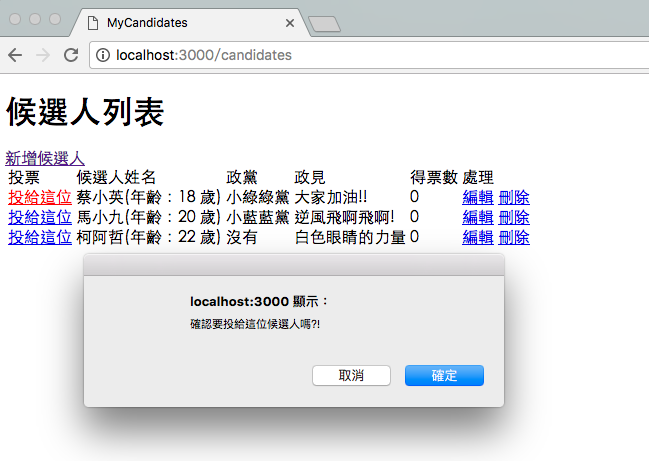

按下「確定」按鈕後即可進行投票：

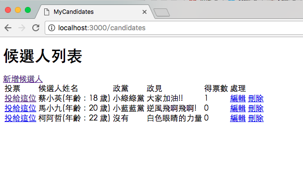

票數的確增加了!

### <a name="step12"></a>第 12 步 - 整理重複的程式碼

到這裡大部份的功能已經完成了，但回頭看看 Controller，有好多重複的程式碼，像是這行：

```ruby
@candidate = Candidate.find_by(id: params[:id])
```

就出現了好幾次。在 Controller 裡有一個叫做 `before_action` 的方法，顧名思義，就是可以在每個 Action 執行之前先執行某個方法，例如：

```ruby
class CandidatesController < ApplicationController
  # .. [略] ..

  private
  def candidate_params
    params.require(:candidate).permit(:name, :age, :party, :politics )
  end

  def find_candidate
    @candidate = Candidate.find_by(id: params[:id])
  end
end
```

我在 private 區塊寫了一個叫做 `find_candidate` 的方法，就是專門在做剛剛這個重複的事，然後可以把這個方法掛在 `before_action` 上，並且把重複的程式碼刪除，完整的程式碼會變這樣：

```ruby
class CandidatesController < ApplicationController
  before_action :find_candidate, only: [:edit, :update, :destroy, :vote]

  def index
    @candidates = Candidate.all
  end

  def new
    @candidate = Candidate.new
  end

  def edit
  end

  def update
    if @candidate.update_attributes(candidate_params)
      # 成功
      redirect_to candidates_path, notice: "資料更新成功!"
    else
      # 失敗
      render :edit
    end
  end

  def create
    @candidate = Candidate.new(candidate_params)

    if @candidate.save
      # 成功
      redirect_to candidates_path, notice: "成功新增候選人!"
    else
      # 失敗
      render :new
    end
  end

  def destroy
    @candidate.destroy if @candidate
    redirect_to candidates_path, notice: "候選人資料已刪除!"
  end

  def vote
    @candidate.increment(:votes)
    @candidate.save
    redirect_to candidates_path, notice: "完成投票!"
  end

  private
  def candidate_params
    params.require(:candidate).permit(:name, :age, :party, :politics )
  end

  def find_candidate
    @candidate = Candidate.find_by(id: params[:id])
  end
end
```

其中，因為不是每個 Action 都需要先做 `find_candidate`，所以在 `before_action` 後面加上了 `only`，只有這幾個方法需要先處理。

接下來這兩個步驟是非必須的，但可以讓我們做出來的東西更漂亮一點，程式碼也會再精簡一些。

### <a name="step13"></a>第 13 步 - 使用 bootstrap 來美化頁面

現在的畫面其實有點醜醜的，如果你沒有設計師幫你設計頁面或調整 CSS，這樣的東西也不好意思拿出去見人。還好，網路上的厲害的善心人士很多，像是 Twitter Bootstrap(以下簡稱 bootstrap)就是一例，透過 bootstrap，只要簡單幾行就可以讓原來看起來有點陽春的畫面一下子就變得高大上。

要使用 bootstrap 有好幾種用法，根據 bootstrap 的[官方網站說明](http://getbootstrap.com/getting-started/)，可以使用 CDN 的方式，也可直接下載 JavaScript/CSS 檔案，但在 Rails 專案裡，我個人偏好使用另外把 bootstrap 打包好的 gem。

這個 gem 的名字是 `bootstrap-sass`，原始程式碼及安裝說明請參閱[這裡](https://github.com/twbs/bootstrap-sass)。

另外，為了讓全站每一頁都使用 bootstrap 的功能，請編輯 `app/views/layouts/application.html.erb` 檔案，把 `<%= yield %>` 外面用一個 `<div>` 包起來，並且設定這個 div 的 `class` 為 `container`：

```erb
<!DOCTYPE html>
<html>
  <head>
    <title>MyCandidates</title>
    <%= csrf_meta_tags %>

    <%= stylesheet_link_tag    'application', media: 'all', 'data-turbolinks-track': 'reload' %>
    <%= javascript_include_tag 'application', 'data-turbolinks-track': 'reload' %>
  </head>

  <body>
    <div class="container">
    <%= yield %>
    </div>
  </body>
</html>
```

Layout 的用途在後面的章節會有更詳細的介紹。

> 注意：安裝完 gem 之後，可能會需要重新啟動 `rails server`。

重新整理一下，原來的畫面有一些變化了：
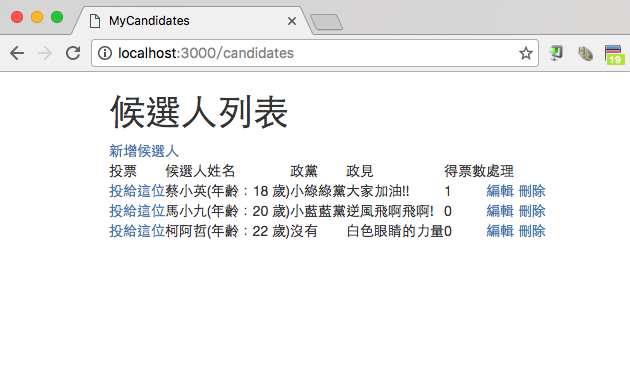

讓我們用 bootstrap 幫原來醜醜的 `<table>` 化個妝。請打開 `app/views/candidates/index.html.erb`，幫原來的 `<table>` 加上一個 `class`：

```erb
<h1>候選人列表</h1>

<%= link_to "新增候選人", new_candidate_path %>

<table class="table">
  <thead>
    <tr>
      <td>投票</td>
      <td>候選人姓名</td>
...[略]...
```

重新整理一下，表格應該會立刻變一個樣子：
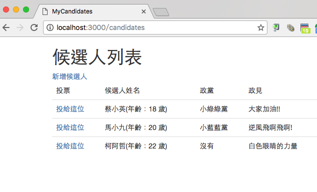

那個投票的連結不太明顯，讓我們用 bootstrap 把它化妝成一顆按鈕的樣子，就在原來的 `link_to` 後面加上 `class` 語法，像這樣：

```erb
<td><%= link_to "投給這位", vote_candidate_path(candidate), method: "post", data: { confirm: "確認要投給這位候選人嗎?!" }, class:"btn btn-danger btn-xs" %></td>
```

後面那個 `btn btn-danger btn-xs` 的意思是指「一顆紅色(危險)但又是小號(xs)的按鈕」，存檔後重新整理，原來的連結看起來就像一顆按鈕了。

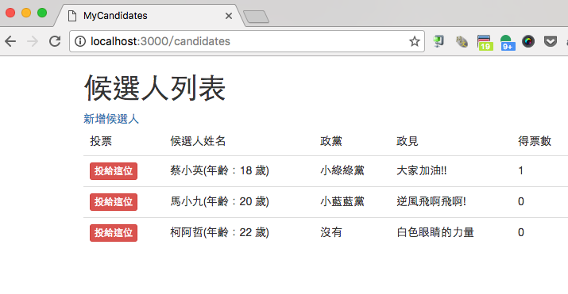

### <a name="step14"></a>第 14 步 - 使用 gem 來簡化表單

雖然使用 `form_for` 跟一些 form helper 來製作表單不是很困難的事，但有個叫做 `simple_form` 的 gem 可以再簡化這些語法，原始碼及使用方法請見[這裡](https://github.com/plataformatec/simple_form)。不過因為我們前面剛好有安裝 bootstrap，如果想要讓 simple_form 跟它更整合的話，在安裝的時候請記得使用這行指令(其實網站上就有提到)：

    $ rails generate simple_form:install --bootstrap

> 注意：安裝完 gem 之後，可能會需要重新啟動 `rails server`。

simple_form 可以用來取代原來的 `form_for`，原來那個 Partial Render 的 `_form.html.erb`：

```erb
<%= form_for(@candidate) do |f| %>
  <%= f.label :name, "姓名" %>
  <%= f.text_field :name %> <br />

  <%= f.label :age, "年齡" %>
  <%= f.text_field :age %> <br />

  <%= f.label :party, "政黨" %>
  <%= f.text_field :party %> <br />

  <%= f.label :politics, "政見" %>
  <%= f.text_area :politics %> <br />

  <%= f.submit %>
<% end %>

<br />
<%= link_to '回候選人列表', candidates_path %>
```

用 `simple_form` 改寫之後可以變成這樣：

```erb
<%= simple_form_for(@candidate) do |f| %>
  <%= f.input :name, label: "姓名" %>
  <%= f.input :age, label: "年齡" %>
  <%= f.input :party, label: "政黨" %>
  <%= f.input :politics, label: "政見" %>
  <%= f.submit %>
<% end %>

<br />
<%= link_to '回候選人列表', candidates_path %>
```

原本的 `f.text_field` 或是 `f.text_area`，都可統一改成 `f.input`，simple_form 會根據資料表的欄位型態，自動轉換成單行或多行輸入欄位。另外，也因為整合了 bootstrap，現在的畫面會變成這樣：

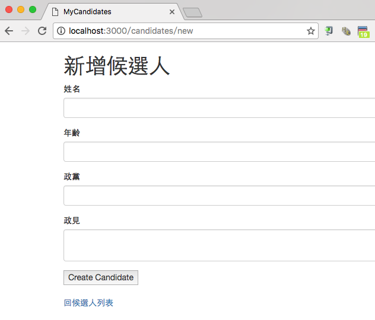

不僅程式碼變精簡了，畫面也變好看了。

> 以上實作完整程式碼可在[這裡](https://github.com/kaochenlong/my_candidates)取得。

