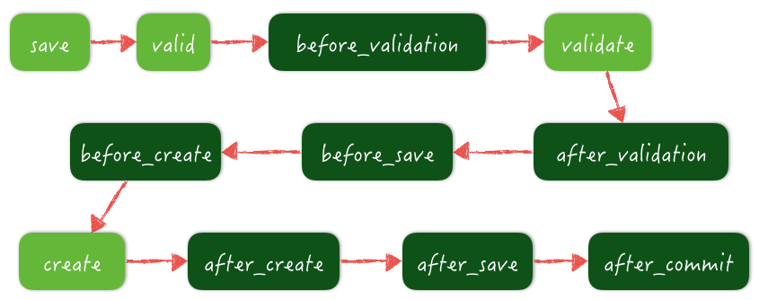

# Model 驗證及回呼

- [資料驗證 (Validation)](#validation)
- [回呼 (Callback)](#callback)

## <a name="validation"></a>資料驗證 (Validation)

開發網站應用程式，資料的正確性是很重要的。大家應該都不會想被有意或無意的在資料庫裡塞了奇怪的資料，所以通常都會加上資料驗證的機制，確保寫入的資料是符合規定的。

### 驗證該在哪裡做?

那，這個資料驗證機制該寫在哪裡比較好呢? 有常見的選項有：

1. 前端驗證：在 HTML 頁面使用 JavaScript 在使用者填寫資料的時候就先檢查。
2. 後端驗證：資料傳進來在寫入資料庫之前之後再檢查。
3. 資料庫驗證：直接由資料庫本身所提供的功能來做資料驗證。

雖然前端驗證簡單容易做，但如果如果使用者關掉 JavaScript 功能，或是直接檢視 HTML 原始碼，自己做一個一樣的表單，一樣可以送資料進來，所以即使在 HTML 頁面已經有驗證，在寫入資料庫前還是得再做一次檢查。

資料庫驗證雖然可行，但缺點不見得每種資料庫系統都有提供一樣的功能，一但換了資料庫系統可能會沒辦法正常運作。但如果這個資料庫還有跟其它程式語言開發的系統共用的話，資料庫驗證比較能確保不管是哪個系統寫進來的資料都是正確的了。

資料驗證這件事在 Rails 的 MVC 三分天下的架構中，Controller 跟 Model 都可以做這件事，要在 View 裡寫 JavaScript 做檢查也可以，但這件事如果交給 Controller 或 View 來做的話，一來會讓程式碼的邏輯變得更複雜，二來這個驗證也不容易被重複使用，也不容易被測試，所以資料機制寫在 Model 裡是比較合理而且單純的。

### 在 Model 裡加上驗證

假設我們有一個叫做 `Article` 的 Model，然後我們希望每篇文章的文章標題 (title) 是必填資訊，那我們可以這樣寫：

```ruby
class Article < ApplicationRecord
  validates :title, presence: true
end
```

中間那行的意思是「title 這個欄位為必填欄位」，讓我們開 `rails console` 起來試一下：

    $ rails console
    >> a1 = Article.new
    => #<Article id: nil, title: nil, content: nil, is_online: nil, created_at: nil, updated_at: nil, photo: nil, user_id: nil>

先用 `new` 方法建立一個 Article 物件，然後用 `errors` 方法看一下這個物件有沒有什麼狀況：

    >> a1.errors.any?
    => false

看來沒什麼問題。接著試著呼叫 `save` 方法把這顆物件存入資料表：

    >> a1.save
       (0.2ms)  begin transaction
       (0.1ms)  rollback transaction
    => false

失敗了，並且回傳 false，來看看到底是哪邊有問題：

    >> a1.errors.any?
    => true

原本沒問題的，在 `save` 之後變得有問題了。來看看錯誤訊息是什麼：

    >> a1.errors.full_messages
    => ["Title can't be blank"]

除了 `validates :title, presence: true` 之外，還有另一種寫法：

```ruby
class Article < ActiveRecord::Base
  validates_presence_of :title
end
```

效果也是一樣的。

除了 `presence` 之外，Rails 還有提供其它像是 `uniqueness`、`length` 或 `numericality` 等便利的驗證器，使用方法可直接參考 Rails Guide 的 [Validations 章節](http://guides.rubyonrails.org/active_record_validations.html)。

### 不是每個方法都會被驗證...

雖然驗證功能很方便，但並不是每種方法都會觸發驗證，僅有以下這些方法會觸發驗證：

- create
- create!
- save
- save!
- update
- update!

其它方法不會經過驗證流程喔

像 `toggle!` 或 `increment!` 等方法會跳過驗證流程。

> 有驚嘆號版本的，如果驗證未通過會產生錯誤訊息，而沒有驚嘆號版本則僅會回傳該 Model 的一個空物件。

如果想要主動的跳過驗證的話，也可在呼叫 `save` 的時候加上 `validate: false` 的參，像這樣：

```ruby
user1 = User.new
user1.save(validate: false)
```

### 驗證沒過的時候...

當資料驗證沒過的時候，可以透過該物件本身的 `errors` 方法得知。一樣先做一顆新的 User 物件，其中 `name` 欄位為必填欄位：

    $ rails console
    >> user1 = User.new
    => #<User id: nil, name: nil, age: nil, email: nil, created_at: nil, updated_at: nil>

試著呼叫 `save` 方法，要把這筆資料寫入資料表：

    >> user1.save
       (0.3ms)  begin transaction
       (0.1ms)  rollback transaction
    => false

失敗了! 這時候可以透過 `errors` 方法看一下到底是哪裡出錯：

    >> user1.errors
    => #<ActiveModel::Errors:0x007ff6b94aa7d8 ...[略]..., @messages={:name=>["can't be blank"]}, @details={:name=>[{:error=>:blank}]}>
    >> user1.errors.full_messages
    => ["Name can't be blank"]

喔，原來是 `name` 欄位沒填寫。

### 在 `save` 的時候才發生驗證錯誤嗎?

有些人可能以為要呼叫 `save` 或 `create` 方法，試圖把資料寫入資料表的時候才會發生驗證錯誤，其實上不用寫入資料表也可以知道這筆資料是否有效。先用 `new` 方法建立一個 User 物件：

    >> user1 = User.new
    => #<User id: nil, name: nil, age: nil, email: nil, created_at: nil, updated_at: nil>

這時候檢查一下是不是有錯誤訊息：

    >> user1.errors.any?
    => false

很好! 沒有任何錯誤訊息。這時候用 `valid?` 方法問一下這筆資料是否能通過驗證：

    >> user1.valid?
    => false

啊，沒通過驗證! 再回頭看一下是不是有錯誤訊息：

    >> user1.errors.any?
    => true
    >> user1.errors.full_messages
    => ["Name can't be blank"]

即使沒有執行 `save` 方法，也是會觸發驗證的。


### 自訂驗證器 Validator

現有的驗證器不夠用嗎? 有幾種方式可以自訂驗證器：

#### 1. 寫一個方法，掛到 `validate` 方法上：

```ruby
class User < ActiveRecord::Base
  validate :name_validator

  private
  def name_validator
    unless name.starts_with? 'Ruby'
      errors[:name] << "必需是 Ruby 開頭喔!"
    end
  end
end
```

> 注意：這個方法是 `validate`，不是 `validates` 喔

這種寫法滿簡單的，就是直接寫一個一般的方法(通常會放在 `private` 區塊)，當條件不符規定的時候，就在 `errors` 這個 Hash 裡面塞錯誤訊息。用起來就跟一般的驗證器差不多：

    $ rails console
    Running via Spring preloader in process 4628
    Loading development environment (Rails 5.0.1)
    >> user1 = User.new(name: "孫悟空")
    => #<User id: nil, name: "孫悟空", age: nil, email: nil, created_at: nil, updated_at: nil>
    >> user1.save
       (0.1ms)  begin transaction
       (0.3ms)  rollback transaction
    => false
    >> user1.errors.full_messages
    => ["Name 必需是 Ruby 開頭喔!"]


#### 2. 遵循 Rails 的驗證器規則：

想寫出這樣的語法嗎?

```ruby
class User < ActiveRecord::Base
  validates :name, presence: true, begin_with_ruby: true
end
```

這個驗證器可以跟其它內建的驗證器一起混著使用，使用起來會更簡潔。要寫這樣的驗證器需要符合 Rails Validator 的命名規則：

1. 參數是 `begin_with_ruby` 的話，類別名稱則是 `BeginWithRuby` 加上 `Validator`，並繼承自 `ActiveModel::EachValidator` 類別。
2. 必須實作 `validate_each` 方法。

大概像這樣：

```ruby
class BeginWithRubyValidator < ActiveModel::EachValidator
  def validate_each(record, attribute, value)
    unless value.starts_with? 'Ruby'
      record.errors[attribute] << "必需是 Ruby 開頭喔!"
    end
  end
end
```

然後在使用的時候，就是跟一般的 `validates` 差不多：

```ruby
class User < ActiveRecord::Base
  validates :name, begin_with_ruby: true
end
```

在 `rails console` 試一下效果：

    $ rails console
    Running via Spring preloader in process 4750
    Loading development environment (Rails 5.0.1)
    >> user1 = User.new(name: "孫悟空")
    => #<User id: nil, name: "孫悟空", age: nil, email: nil, created_at: nil, updated_at: nil>
    >> user1.save
       (0.1ms)  begin transaction
       (0.0ms)  rollback transaction
    => false
    >> user1.errors.full_messages
    => ["Name 必需是 Ruby 開頭喔!"]


## <a name="callback"></a>回呼 (Callback)

資料在要存到資料表的過程中，其實不是直接把資料放進去這麼簡單。不同的行為(例如存檔、或刪除)可能會有不同的流程，舉個例子來說，當呼叫 `save` 方法的時候，整個資料寫入的過程大概會是以下的流程：



其中，顏色比較深的那幾個流程是有機會可以掛上一些方法，又稱之回呼(Callback)，可以在這些流程執行的時候做一些事，像是這樣：

```ruby
require 'digest'

class User < ActiveRecord::Base
  before_create :encrypt_email

  private
  def encrypt_email
    self.email = Digest::MD5.hexdigest(email)
  end
end
```

上面這段範例可以在建立使用者資料之前，先對 email 進行 MD5 加密。

> 注意：`before_save` 跟 `before_create` 的差別，在於 `before_save` 是每次存檔的時候都會經過，但 `before_create` 只有在「新增」的時候才會觸發。

除了這樣的寫法，如果內容單純的話，也是可以使用 Block 的方式來寫：

```ruby
require 'digest'
class User < ActiveRecord::Base
  before_create do
    self.email = Digest::MD5.hexdigest(email)
  end
end
```

關於其它回呼的使用方式，可參考 Rails Guide 上關於 [Callback 章節](http://guides.rubyonrails.org/active_record_callbacks.html)的說明

